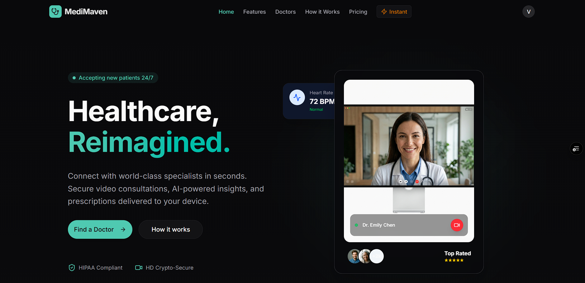
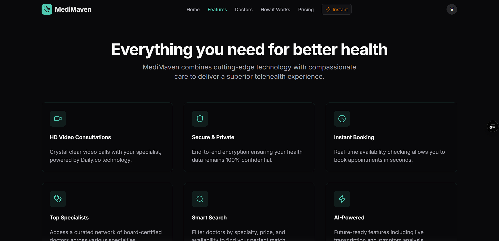
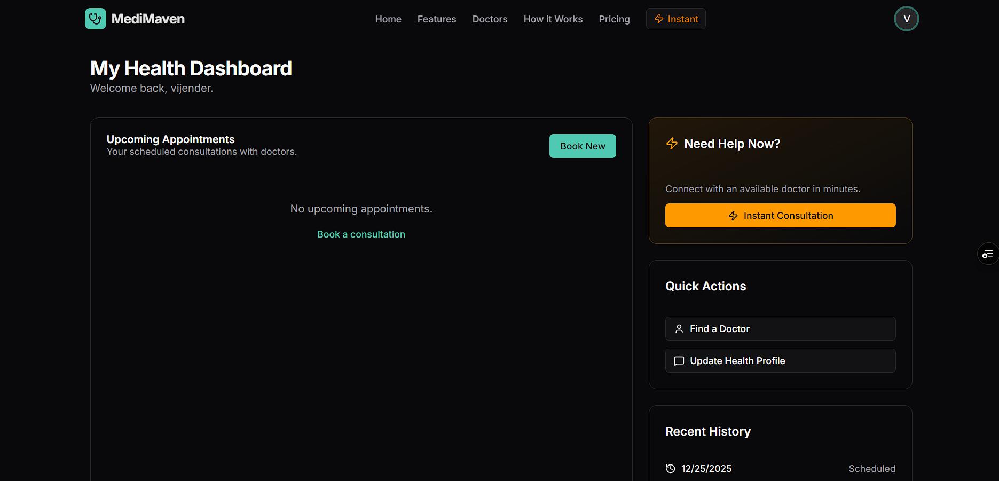
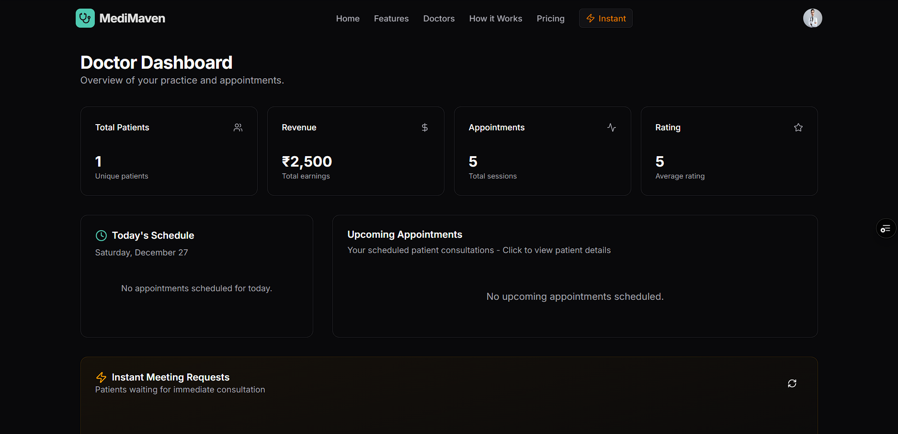
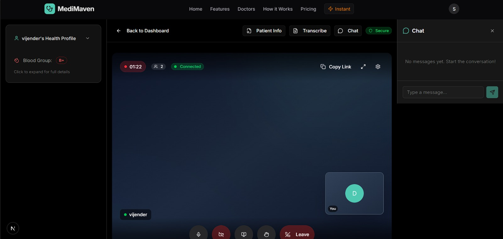
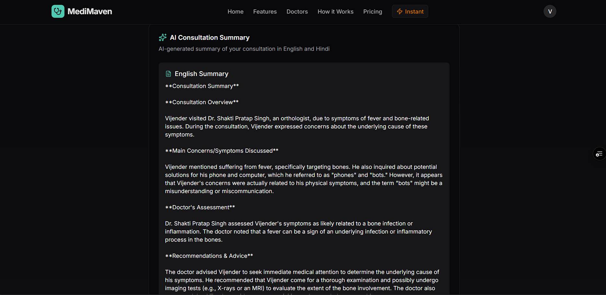
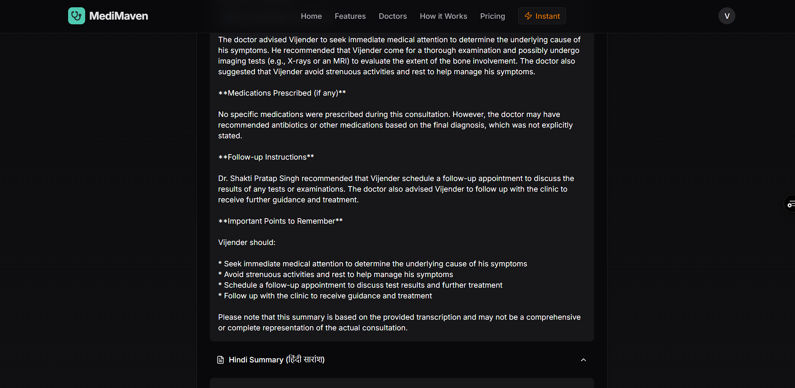

# MediMaven 🏥 - Next-Gen Telehealth Platform



## Figma Design
[View the Design](https://www.figma.com/design/NFR1b83mk41PQXtwJrS6at/MediMaven---Website-UI?node-id=1-2&t=jmZOcxnLWOjF8icD-1)

## 🎥 Demo Video
[Watch the Demo](https://drive.google.com/file/d/15xWC5kQqL9bmjM3XXvk1J4y9YorNMrSk/view?usp=sharing)


> **Hackathon Track**: Use Case 2 – Telehealth Solution for Access to Healthcare from Anywhere.

MediMaven is a cutting-edge **Telehealth platform** designed to bridge the gap between patients and healthcare providers, ensuring instant, secure, and accessible medical consultations from the comfort of your home. Built for the modern world, it integrates advanced video conferencing, real-time transcription, and secure payment processing to deliver a seamless healthcare experience.

> 🌓 **Theme Support**: MediMaven features automatic light and dark mode that adapts to your browser and system settings for optimal viewing comfort. *All screenshots in this README are displayed in dark mode.*

---

## 📑 Table of Contents

1. [Key Features & Hackathon Requirements](#-key-features--hackathon-requirements)
2. [How It Works - User Journeys](#-how-it-works---user-journeys)
3. [Technical Architecture](#-technical-architecture)
4. [API Integrations Deep Dive](#-api-integrations-deep-dive)
5. [Database Schema](#-database-schema)
6. [Environment Setup Guide](#-environment-setup-guide)
7. [Getting Started](#-getting-started)
8. [Screenshots](#-application-screenshots)
9. [Contributors](#-contributors)

---

## 🚀 Key Features & Hackathon Requirements

This project directly addresses the hackathon problem statement by implementing the following core solutions:

### 1. 📹 Instant Video Consultations (Daily.co)
**"Instant access to Health consultation similar to in person experience"**
- High-definition, low-latency video calls powered by **Daily.co WebRTC**.
- Secure, HIPAA-compliant video rooms generated dynamically for each appointment.
- Screen sharing and in-call chat support for better diagnosis.
- Automatic room creation and management via Daily.co REST API.

### 2. 💳 Integrated Payments (Square Up)
**"Ability to accept payment for the Telehealth consultation before the actual consultation begins"**
- Seamless payment gateway integration using **Square Web Payments SDK**.
- Patients must pay upfront before joining any consultation.
- Supports credit/debit cards with secure PCI-compliant tokenization.
- Real-time payment status tracking and transaction records.

### 3. 📝 Live Transcription & AI Summary (DeepGram & OpenRouter)
**"Overcome challenges of difference in dialect/accent in remote consultation via a transcription service"**
- **DeepGram Nova-2**: Real-time, medical-grade speech-to-text transcription during video calls using WebSocket streaming. Supports multiple Indian languages and accents (en-IN).
- **OpenRouter (Free LLMs)**: Generates intelligent bilingual post-consultation summaries (English & Hindi) from transcripts, highlighting diagnosis, prescriptions, and follow-up actions.

### 4. ⚡ Instant Meeting System
**On-demand doctor consultations for urgent medical needs**
- Patients can request immediate consultations without prior appointment.
- Doctors see real-time queue of waiting patients in their specialty.
- First-come-first-served matching with automatic notifications.
- Full payment integration before doctor accepts.

### 5. 📅 Scheduled Appointments
**Traditional appointment booking with calendar integration**
- Browse doctors by specialty with detailed profiles.
- Real-time availability checking with IST timezone support.
- Slot-based booking with conflict prevention.
- Join window management (10 min before to session end).

### 6. 👤 Comprehensive Health Profiles
**Patient health data management for better consultations**
- Complete health profile: blood group, allergies, chronic conditions, medications.
- Emergency contact information.
- Medical history accessible to doctors during consultations.
- Patient health card displayed during video calls.

---

## 🔄 How It Works - User Journeys

### Patient Journey

#### A. Booking a Scheduled Appointment

```
1. BROWSE DOCTORS
   └── Visit /doctors page
   └── Filter by specialty (Cardiologist, Dermatologist, etc.)
   └── View doctor profiles (experience, price, ratings)

2. SELECT TIME SLOT
   └── Choose a date from the calendar
   └── See available slots (IST timezone)
   └── Past slots and booked slots are automatically hidden
   └── Select preferred time slot

3. MAKE PAYMENT
   └── Review appointment summary
   └── Enter card details (Square secure form)
   └── Payment processed before booking confirmed
   └── Receive booking confirmation

4. JOIN CONSULTATION
   └── Visit patient dashboard
   └── "Join Call" button appears 10 minutes before appointment
   └── Enter Daily.co video room
   └── Real-time transcription runs during call
   └── In-call chat available

5. POST-CONSULTATION
   └── Rate the doctor (1-5 stars)
   └── View AI-generated summary (English + Hindi)
   └── Access consultation history anytime
```

#### B. Instant Meeting (Urgent Consultations)

```
1. REQUEST INSTANT MEETING
   └── Visit /session/instant
   └── Select required specialty
   └── Pay fixed consultation fee (₹1500)

2. ENTER WAITING ROOM
   └── Redirected to waiting room page
   └── Real-time status polling (every 3 seconds)
   └── See position in queue
   └── Cancel option available (with auto-refund note)

3. DOCTOR ACCEPTS
   └── Instant notification when matched
   └── Automatic redirect to video room
   └── Consultation begins immediately

4. CONSULTATION & REVIEW
   └── Same video experience as scheduled appointments
   └── Transcription and AI summary available
   └── Rate and review the consultation
```

### Doctor Journey

```
1. VIEW DASHBOARD
   └── See today's schedule with patient list
   └── Upcoming appointments across all dates
   └── Revenue and patient statistics
   └── Weekly calendar view

2. MANAGE INSTANT MEETING REQUESTS
   └── Real-time queue of waiting patients (polls every 10 seconds)
   └── See patient details before accepting
   └── One-click accept to join immediately
   └── Only see patients matching your specialty

3. JOIN CONSULTATIONS
   └── "Join Call" button for scheduled appointments
   └── Automatic redirect after accepting instant meetings
   └── View patient health card during call
   └── Access patient's health profile and history

4. POST-CONSULTATION
   └── Transcription saved automatically
   └── Can view AI-generated summaries
   └── Track completed consultations
```

### Admin Journey

```
1. MANAGE DOCTORS
   └── Create new doctor accounts
   └── Edit doctor profiles and credentials
   └── Set consultation prices and availability
   └── View all doctors in the system

2. SYSTEM OVERSIGHT
   └── Access to all appointments
   └── User management capabilities
   └── Platform statistics
```

---

## 🏗️ Technical Architecture

### Technology Stack

| Layer | Technology |
|-------|------------|
| **Framework** | Next.js 16.1.1 (App Router) with Turbopack |
| **Frontend** | React 19, TailwindCSS 4, Framer Motion |
| **UI Components** | Radix UI Primitives, shadcn/ui |
| **Backend** | Next.js Server Actions, API Routes |
| **Database** | MongoDB with Mongoose ODM |
| **Authentication** | NextAuth.js v5 (Beta) with Credentials Provider |
| **Video Calls** | Daily.co WebRTC API |
| **Payments** | Square Web Payments SDK |
| **Transcription** | DeepGram Nova-2 (WebSocket Streaming) |
| **AI Summaries** | OpenRouter (Free LLM Models) |
| **Deployment** | Vercel (Edge Functions + Serverless) |

### Project Structure

```
MediMaven/
├── src/
│   ├── app/                    # Next.js App Router
│   │   ├── actions/           # Server Actions
│   │   │   ├── admin.ts       # Admin operations
│   │   │   ├── ai-summary.ts  # OpenRouter AI integration
│   │   │   ├── appointment.ts # Booking logic
│   │   │   ├── chat.ts        # In-call messaging
│   │   │   ├── doctor.ts      # Doctor queries
│   │   │   ├── instant-meeting.ts # Instant consultation logic
│   │   │   └── profile.ts     # User profile management
│   │   ├── api/
│   │   │   ├── auth/          # NextAuth handlers
│   │   │   └── daily/         # Daily.co room management
│   │   ├── admin/             # Admin dashboard
│   │   ├── doctor/            # Doctor dashboard
│   │   ├── patient/           # Patient dashboard & onboarding
│   │   ├── doctors/           # Doctor listing & booking
│   │   └── session/           # Video call sessions
│   │       ├── [id]/          # Scheduled appointment rooms
│   │       ├── instant/       # Instant meeting flow
│   │       └── book/          # Appointment booking
│   ├── components/
│   │   ├── booking/           # Payment & time slot components
│   │   ├── dashboard/         # Dashboard widgets
│   │   ├── video/             # Video call components
│   │   ├── ui/                # Reusable UI components
│   │   └── layout/            # Navbar, Footer
│   ├── hooks/
│   │   └── useDeepgramTranscription.ts  # WebSocket transcription
│   ├── lib/
│   │   ├── models/            # Mongoose schemas
│   │   ├── auth.ts            # NextAuth configuration
│   │   ├── mongoose.ts        # Database connection
│   │   ├── date-utils.ts      # IST timezone utilities
│   │   └── utils.ts           # Helper functions
│   └── types/
│       └── next-auth.d.ts     # Type definitions
├── scripts/
│   ├── create-admin.ts        # Admin user creation
│   ├── seed-doctors.ts        # Sample doctor data
│   └── fix-stuck-instant-meetings.ts  # Maintenance script
└── public/
    └── assets/                # Images and static files
```

### Key Design Patterns

1. **Server Actions**: All data mutations use Next.js Server Actions for type-safe, secure server-side operations.

2. **Optimistic Updates**: UI updates immediately while server operations complete in background.

3. **IST Timezone Handling**: All dates are converted to Indian Standard Time (UTC+5:30) for consistent display across deployment environments (see `src/lib/date-utils.ts`).

4. **Real-time Polling**: Instant meeting queues and waiting rooms use polling for real-time updates without WebSocket complexity.

5. **Atomic Operations**: MongoDB `findOneAndUpdate` with conditions prevents race conditions in instant meeting matching.

---

## 🔌 API Integrations Deep Dive

### 1. Daily.co - Video Conferencing

**How it works:**

```typescript
// Room Creation (src/app/api/daily/route.ts)
POST /api/daily
├── Receives: { roomName: string }
├── Creates Daily.co room via REST API
├── Sets properties: screenshare, chat, 1-hour expiry
└── Returns: { url: string, name: string }

// Room Joining (src/components/video/DailyVideoRoom.tsx)
├── Uses @daily-co/daily-react hooks
├── DailyProvider wraps video components
├── Automatic audio/video device management
└── Call state management (joining, joined, left)
```

**Key Features:**
- Dynamic room creation per appointment
- Automatic room cleanup after expiry
- Screen sharing for showing reports
- In-call chat for sharing links/notes

### 2. Square - Payment Processing

**How it works:**

```typescript
// Payment Flow (src/components/booking/PaymentForm.tsx)
1. Patient enters card → Square SDK tokenizes
2. Token sent to server action
3. Server creates payment via Square Payments API
4. Transaction ID stored in database
5. Appointment status updated to "paid"

// Server Processing (src/app/doctors/[id]/payment-actions.ts)
├── Receives: { amount: number, sourceId: string (token) }
├── Creates Square PaymentsApi client
├── Processes payment with idempotency key
└── Returns: { success: boolean, transactionId: string }
```

**Security:**
- Card data never touches our server (tokenization)
- PCI-compliant Square SDK
- Idempotency keys prevent duplicate charges
- Sandbox mode for testing

**Testing Card Details:**
- 411111111111
- any future date
- any 3 number cvv
- Any 5 number

### 3. DeepGram - Real-time Transcription

**How it works:**

```typescript
// WebSocket Flow (src/hooks/useDeepgramTranscription.ts)
1. Get user microphone permission
2. Open WebSocket to Deepgram API
3. Stream audio chunks via MediaRecorder
4. Receive real-time transcript results
5. Display interim + final results

// Configuration
├── Model: Nova-2 (medical-optimized)
├── Language: en-IN (Indian English)
├── Features: punctuation, smart_format
└── Encoding: linear16 @ 16kHz
```

**Key Features:**
- Interim results for live feedback
- Final results for accuracy
- Handles Indian accents and dialects
- Medical terminology support

### 4. OpenRouter - AI Summaries

**How it works:**

```typescript
// Summary Generation (src/app/actions/ai-summary.ts)
1. After consultation ends, transcription is saved
2. Patient/Doctor requests summary
3. Server sends transcript to OpenRouter
4. Uses free LLM models with fallback chain
5. Returns bilingual summary (English + Hindi)

// Model Fallback Chain
├── meta-llama/llama-3.2-3b-instruct:free
├── meta-llama/llama-3.1-8b-instruct:free
├── google/gemma-2-9b-it:free
├── mistralai/mistral-7b-instruct:free
└── ... (7 models total)
```

**Summary Structure:**
- Key Discussion Points
- Symptoms Discussed
- Recommendations/Prescriptions
- Follow-up Actions
- Both English and Hindi versions

---

## 📊 Database Schema

### User Model
```typescript
{
  name: string,
  email: string (unique),
  password: string (hashed),
  role: "patient" | "doctor" | "admin",
  // Doctor fields
  specialty?: string,
  bio?: string,
  doctorProfile?: {
    price: number,
    consultationDuration: number,
    qualifications: string[],
    experience: number,
    availability: {
      days: string[],
      startTime: string,
      endTime: string
    }
  },
  // Patient fields
  gender?: string,
  dob?: Date,
  healthProfile?: {
    bloodGroup?: string,
    allergies?: string[],
    chronicConditions?: string[],
    medications?: string[],
    emergencyContact?: { name, relation, phone }
  }
}
```

### Appointment Model
```typescript
{
  patientId: ObjectId → User,
  doctorId: ObjectId → User,
  date: Date,
  duration: number,
  status: "scheduled" | "in-progress" | "completed" | "cancelled",
  paymentStatus: "pending" | "paid" | "failed",
  amount: number,
  meetingLink: string,
  notes?: string,
  transcription?: string,
  summary?: { english: string, hindi: string, generatedAt: Date },
  rating?: number,
  review?: string
}
```

### InstantMeeting Model
```typescript
{
  patientId: ObjectId → User,
  doctorId?: ObjectId → User,
  specialty: string,
  status: "waiting" | "matched" | "in-progress" | "completed" | "cancelled",
  paymentStatus: "pending" | "paid" | "failed",
  amount: number,
  meetingLink?: string,
  matchedAt?: Date,
  completedAt?: Date,
  transcription?: string,
  summary?: { english: string, hindi: string }
}
```

---

## ⚙️ Environment Setup Guide

### Required Environment Variables

Create a `.env.local` file in the project root:

```env
# ============================================
# DATABASE - MongoDB Atlas
# ============================================
# Get from: https://cloud.mongodb.com
# Create a cluster → Get connection string
MONGODB_URI=mongodb+srv://<username>:<password>@<cluster>.mongodb.net/<dbname>?retryWrites=true&w=majority

# ============================================
# AUTHENTICATION - NextAuth.js
# ============================================
# Generate with: openssl rand -base64 32
AUTH_SECRET=your-super-secret-key-min-32-chars

# Required for NextAuth callbacks
NEXTAUTH_URL=http://localhost:3000

# ============================================
# VIDEO CALLS - Daily.co
# ============================================
# Get from: https://dashboard.daily.co/developers
# 1. Create account → Go to Developers tab
# 2. Copy API Key
DAILY_API_KEY=your_daily_api_key_here

# ============================================
# PAYMENTS - Square
# ============================================
# Get from: https://developer.squareup.com/apps
# 1. Create application
# 2. Get Sandbox credentials (for testing)
# 3. Use Production for live payments

# Sandbox (Testing)
NEXT_PUBLIC_SQUARE_APP_ID=sandbox-sq0idb-xxxxxxxxxxxx
NEXT_PUBLIC_SQUARE_LOCATION_ID=LXXXXXXXXXXXXXXXXXX
SQUARE_ACCESS_TOKEN=EAAAE...your_sandbox_access_token

# Production (Live) - Replace sandbox values
# NEXT_PUBLIC_SQUARE_APP_ID=sq0idp-xxxxxxxxxxxx
# NEXT_PUBLIC_SQUARE_LOCATION_ID=LXXXXXXXXXXXXXXXXXX
# SQUARE_ACCESS_TOKEN=EAAAE...your_production_access_token

# ============================================
# TRANSCRIPTION - DeepGram
# ============================================
# Get from: https://console.deepgram.com
# 1. Create account → API Keys section
# 2. Create new API key with "Member" role
NEXT_PUBLIC_DEEPGRAM_API_KEY=your_deepgram_api_key

# ============================================
# AI SUMMARIES - OpenRouter
# ============================================
# Get from: https://openrouter.ai/keys
# 1. Create account → API Keys
# 2. Create new key (free tier available)
OPENROUTER_API_KEY=sk-or-v1-xxxxxxxxxxxx

# ============================================
# APPLICATION URL (for production)
# ============================================
NEXT_PUBLIC_APP_URL=https://your-domain.vercel.app
```

### API Key Setup Instructions

#### 1. MongoDB Atlas (Database)
```
1. Go to https://cloud.mongodb.com
2. Create a new project
3. Build a Database (M0 Free Tier works)
4. Create a database user with password
5. Add your IP to Network Access (or 0.0.0.0/0 for anywhere)
6. Click "Connect" → "Connect your application"
7. Copy the connection string
8. Replace <password> with your database user password
```

#### 2. Daily.co (Video Calls)
```
1. Go to https://dashboard.daily.co
2. Sign up for free account
3. Go to "Developers" tab in left sidebar
4. Copy your API Key
5. Free tier: 10,000 participant minutes/month
```

#### 3. Square (Payments)
```
1. Go to https://developer.squareup.com
2. Create a Square Developer account
3. Create a new application
4. Go to Credentials tab
5. For testing: Use Sandbox credentials
6. Copy Application ID and Access Token
7. Go to Locations → Copy Location ID

Test Card Numbers (Sandbox):
- Success: 4532 7153 3668 1000
- Declined: 4000 0000 0000 0002
```

#### 4. DeepGram (Transcription)
```
1. Go to https://console.deepgram.com
2. Create account (free $200 credits)
3. Go to API Keys section
4. Create new API key
5. Copy the key immediately (shown only once)
```

#### 5. OpenRouter (AI Summaries)
```
1. Go to https://openrouter.ai
2. Create account
3. Go to Keys section
4. Create new API key
5. Free models available (we use 7 free models)
```

---

## 🏁 Getting Started

### Prerequisites
- Node.js v18+ (recommended: v20 LTS)
- npm or yarn
- MongoDB Atlas account (or local MongoDB)
- API keys for Daily.co, Square, DeepGram, and OpenRouter

### Installation

1. **Clone the repository**
   ```bash
   git clone https://github.com/vijenderyadav944/MediMaven.git
   cd MediMaven
   ```

2. **Install dependencies**
   ```bash
   npm install
   ```

3. **Set up Environment Variables**
   ```bash
   cp .env.example .env.local
   # Edit .env.local with your API keys (see setup guide above)
   ```

4. **Create Admin User (Optional)**
   ```bash
   npx tsx scripts/create-admin.ts
   ```

5. **Seed Sample Doctors (Optional)**
   ```bash
   npx tsx scripts/seed-doctors.ts
   ```

6. **Run the development server**
   ```bash
   npm run dev
   ```

7. **Open the app**
   Visit `http://localhost:3000` to see the application.

### Available Scripts

```bash
# Development
npm run dev       # Start dev server with Turbopack

# Production
npm run build     # Build for production
npm run start     # Start production server

# Utilities
npm run lint      # Run ESLint

# Database Scripts
npx tsx scripts/create-admin.ts              # Create admin user
npx tsx scripts/seed-doctors.ts              # Add sample doctors
npx tsx scripts/fix-stuck-instant-meetings.ts # Fix stuck meetings
```

---

## 📸 Application Screenshots

### Home Page
The landing page featuring our mission, services, and easy navigation.


### Key Features
Overview of our platform's capabilities.


### Doctor Search & Booking
Find the right specialist and book appointments with ease.


### Patient Dashboard
Manage appointments, view medical history, and access consultations.


### Doctor Dashboard
Manage availability, view schedule, and handle instant meeting requests.


### Video Consultation
HD video calls with transcription, chat, and patient health cards.


### AI-Generated Summary
Bilingual consultation summaries for easy understanding.



---

## 🔧 Troubleshooting

### Common Issues

**1. MongoDB Connection Failed**
```
Error: MongoServerSelectionError
Solution: Check MONGODB_URI, ensure IP whitelist includes your IP
```

**2. Daily.co Room Creation Failed**
```
Error: Failed to create room
Solution: Verify DAILY_API_KEY is correct and has room creation permissions
```

**3. Payment Processing Failed**
```
Error: Card tokenization failed
Solution: Ensure Square SDK is loaded, check SQUARE_APP_ID and LOCATION_ID
```

**4. Transcription Not Working**
```
Error: Deepgram WebSocket connection failed
Solution: Check NEXT_PUBLIC_DEEPGRAM_API_KEY, ensure browser has microphone permission
```

**5. Timezone Issues on Vercel**
```
Issue: Times showing in UTC instead of IST
Solution: We've implemented IST conversion - all dates use src/lib/date-utils.ts
```

---

## 🚀 Deployment (Vercel)

1. Push code to GitHub
2. Import project in Vercel
3. Add all environment variables in Vercel dashboard
4. Deploy!

**Important Vercel Settings:**
- Framework Preset: Next.js
- Build Command: `npm run build`
- Output Directory: `.next`
- Install Command: `npm install`

---

## 👥 Contributors

- **Vijender** - *Full Stack Developer* - [GitHub](https://github.com/vijenderyadav)
- **Simran** - *Full Stack Developer* - [GitHub](https://github.com/Simran18074)

---

## 📄 License

This project is built for the Hackathon and is available under the MIT License.

---

<p align="center">
  Made with ❤️ for better healthcare access
</p>
